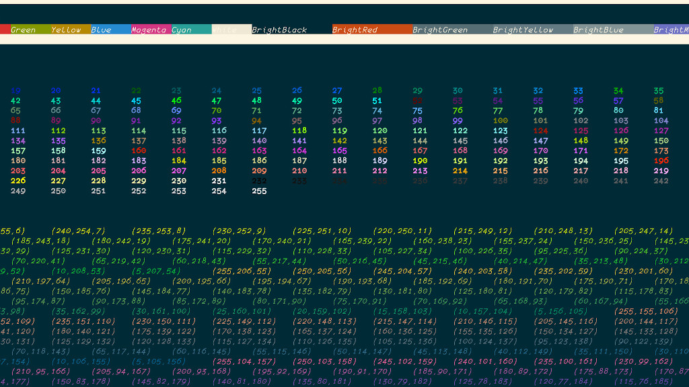
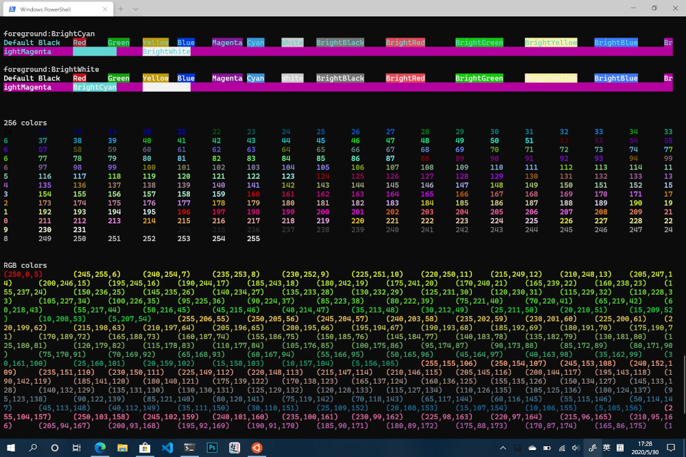

term
[](https://github.com/issue9/term/actions?query=workflow%3AGo)
[](https://goreportcard.com/report/github.com/issue9/term)
[](https://opensource.org/licenses/MIT)
[](https://codecov.io/gh/issue9/term)
[](https://pkg.go.dev/github.com/issue9/term/v3)

======

term 包含了终端控制相关的包：ansi 和 colors 和 prompt。

- ansi 定义了 ansi 转码；
- colors 定义了控制台的彩色字符串输出功能；
- prompt 定义了控制台的交互接口；

```go
// 向 stderr 终端输出蓝底红字的字符串："colors"
colors.Print(colors.Normal, colors.Stdout, colors.Red, colors.Blue, "colors")

// 输出蓝底红字的字符串
c := colors.New(os.Stdout).
	colors.Normal, colors.Red, colors.Blue).
    Println("colors")

// 输出普通文本，颜色信息会被过滤
file := os.Create("path/file")
colors.Fprint(file, colors.Normal, colors.Red, colors.Blue, "colors")
```

安装
----

```shell
go get github.com/issue9/term/v3
```

兼容性
----

colors 兼容 windows 控制台、mingw 和其它所有支持 ansi 控制符的软件

iterm2


windows-terminal


版权
----

本项目采用 [MIT](https://opensource.org/licenses/MIT) 开源授权许可证，完整的授权说明可在 [LICENSE](LICENSE) 文件中找到。
